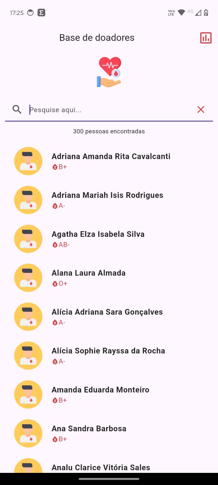
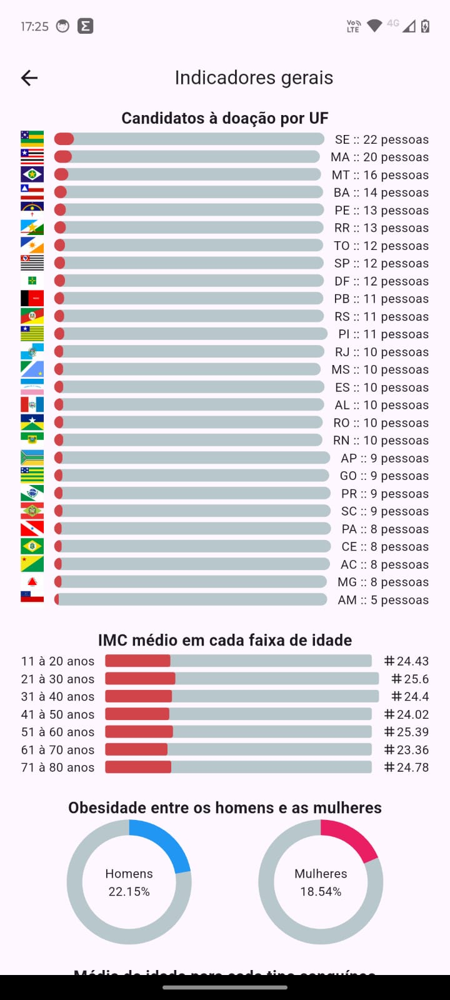

# APP WKTest - Aplicativo para consulta de informações de doadores de sangue

## Descrição

Este é um projeto de um APP mobile que pode ser usado como ferramenta de consulta de informações de pessoas que podem ser doadoras de sangue. O aplicativo consome uma API REST que fornece informações sobre pessoas cadastradas, como nome, idade, peso, altura, gênero, tipo sanguíneo e estado.

## Tecnologias Utilizadas

- Flutter
- GetX (state management)

## Estrutura do Projeto

### Pacotes Principais

- **lib**: Contém o código-fonte do projeto.
  - **data**: Contém as classes de representação e contrele dos dados.
  - **global**: Possui as classes de controle de estado global.
  - **modules**: Onde ficam os módulos da aplicação.
    - **home**: Módulo da tela inicial.
    - **indicadores**: Módulo responsável pela tela de indicadores.
  - **themes**: Contém as classes de estilos da aplicação, como cores, ícones, etc.
  - **utils**: Classes utilitárias.

### Executando a Aplicação

1. Após clonar o projeto, navegue até o diretório dele:
   ```bash
   cd app_wktest
   ```
2. Instale as dependências:
   ```bash
    flutter pub get
   ```
3. Execute o aplicativo:
   ```bash
   flutter run
   ```

## Screenshots

### Tela Inicial


### Tela de Indicadores
